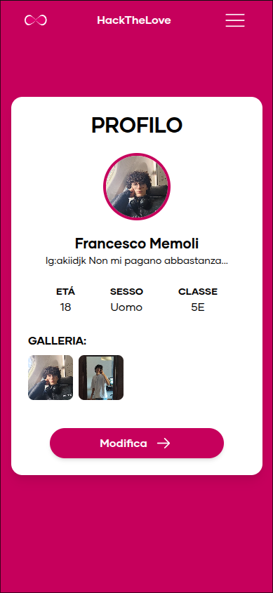

# HackTheLove

HackTheLove è un progetto che punta all obbietivo di replicare una versione semplificata di Tinder. Ma orientata alle scuola e ai ragazzi dai 14 ai 20 anni.

L'applicazione è sviluppata in meno di 3 settimane. e ci sono diversi aspetti da migliorare, come design, ux, funzionalità, perfomance e gestione delle immagini.

Ma il margine di miglioramento e' tanto e pensiamo a un ritorno nel 2026, con nuove funzionalità e miglioramenti.

Figma link delle bozze di design: https://www.figma.com/design/I7Aaqv5rRDBtdrDDqXkl01/Untitled?node-id=0-1&t=Hh4OKWP6dQLgqlIe-1

## Some screenshots

